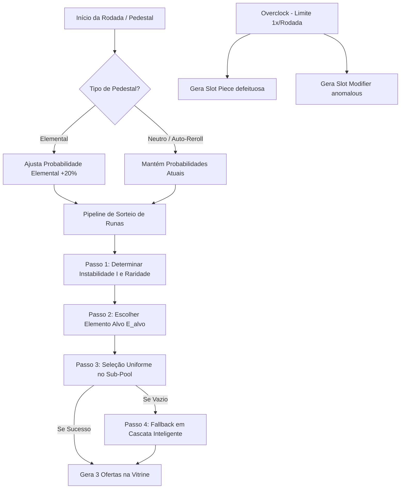

# Plano de Execução — Adequação do Novo Sistema de Economia e Loja

Este documento apresenta o plano de execução técnico e modular para adequar os sistemas de economia e loja do projeto **Runes** no Godot 4.x, em estrita conformidade com a especificação revisada em `Runes/spec/systems/Revisados/economy_shop.md` e as diretrizes matemáticas de `Runes/spec/systems/Revisados/math_formulas.md`.

---

## 📅 Visão Geral e Arquitetura

O ecossistema da economia rúnica opera sob o paradigma de **Desacoplamento e Comunicação por Sinais/EventBus** do projeto Runes. A transição para o novo modelo de loja garante maior agência estratégica do jogador ao introduzir a rotação mágica elemental no visor da vitrine, atrelada à restrição de instabilidade elemental dinâmica.

### Diagrama Funcional do Pipeline de Loja e Ativação

---

## 🛠️ Gap Analysis e Soluções Propostas

### 1. Atualização Estatística de Custos e Preços (`ShopConfig`)
*   **Problema:** O `scripts/data/shop_config.gd` atual calcula os preços das peças de slots, modificadores e relíquias com base em suas raridades originais (no modelo antigo do início de 2026).
*   **Solução:** 
    *   Remover a dependência de raridade no preço de peças, modificadores e relíquias.
    *   Criar um cálculo em runtime do preço de **SlotPieces** baseado estritamente na contagem de seus blocos (`piece.shape.size()` ou `piece.data.get_slot_count()`).
    *   Estabelecer custos fixos fixados:
        *   **Slot Modifiers:** Compra por $4, Venda por $1.
        *   **Relíquias:** Compra por $10, Venda por $5.
    *   Alinhar a tabela de compra/venda de Runas por raridade exatamente aos valores revisados: 
        *   `Common: 2/1`, `Uncommon: 3/1`, `Rare: 5/2`, `Epic: 7/3`, `Legendary: 10/5`.

### 2. Rede de Pedestais e Ajuste Elemental de Probabilidades (`ShopManager`)
*   **Problema:** Atualmente, a loja possui apenas uma rolagem unificada de "pergaminho" que incrementa em custo. O modelo novo de pedestais é infinitamente persistente, opera por 6 variações, possui custo amarrado estritamente em **1 Mana** e manipula as probabilidades herdadas de sorteio de elementos para o restante do jogo.
*   **Solução:**
    *   Adicionar vetor de probabilidade no `ShopManager` para rastrear dinamicamente o peso dos 5 elementos fundamentais (`GameEnums.Element`).
    *   Iniciar ou reiniciar este vetor com base uniforme de 20% (0.20) para cada no início absoluto de uma campanha (`start_game()`).
    *   Implementar a fórmula de redistribuição proporcional clássica: quando $E$ sobe $+20\% = 0.20$, as probabilidades vizinhas sofrem abatimento proporcional que previne colapso negativo (limite final $\min(0.20, 1.0 - P_E)$).

### 3. Pipeline de Geração Rúnica de 4 Passos (`ShopManager`)
*   **Problema:** Atualmente as runas são selecionadas meramente por raridade com pesos definidos no recurso `drop_rates.tres`.
*   **Solução:**
    *   **Determinar Instabilidade ($I$)**: Encontrar o elemento de maior força $P_{max} = \max(P_i)$ e mapear $I = (P_{max} - 0.20) / 0.80$.
    *   **Calcular Decaimento Dinâmico de Raridade**: Aplicar a sensibilidade multiplicadora de drop $S_{\text{rarity}}(I) = (1 - I)^{d_{\text{rarity}}}$ regulada com os expoentes de colapso de cada nível.
    *   **Pipeline de Sorteio**:
        1.  Sorteia a Raridade com pesos ajustáveis por nível e multiplicadores dinâmicos de instabilidade.
        2.  Sorteia o Elemento Alvo ($E_{alvo}$) usando as estatísticas do vetor de probabilidade.
        3.  Monta o pool filtrado e escolhe por debaixo de distribuição uniforme.
        4.  Garante as 3 fases de segurança (Vigilância Elemental $\rightarrow$ Elasticidade Elemental $\rightarrow$ Degradação de nível) na contenção inteligente de pools vazios.

### 4. Overclock de Maquinário Rúnico e Deformação de Itens (`ShopManager` & `SlotInstance`)
*   **Problema:** Não há mecânicas de Overclock de Maquinário implementadas no repositório.
*   **Solução:**
    *   Introduzir uma flag redundante para rastrear se o Overclock já foi acionado nesta rodada em `ShopManager`.
    *   Criar função `trigger_overclock()` que consome exatamente **1 de Mana** e expande a oferta atual de `available_pieces` e `available_modifiers` em 1 unidade adicional defeituosa.
    *   A **SlotPiece** gerada pelo Overclock receberá o metadado permanente `"can_receive_modifiers": false` ao ser criada ou empacotada. Quando desmembrada no `panel_instance.gd`, os slots gerados herdarão esse metadado.
    *   O **SlotModifier** gerado conterá a identidade `anomalous` e gerará o respectivo comportamento deletério.

### 5. Mecânica da Anomalia de Mana de Modificador (`ResidueProcessor`)
*   **Problema:** Os slots modificados de Overclock não possuem a mecânica revisada. Anteriormente a anomalia destruía a runa. Agora ela apenas causa dano monetário de 2 Mana mantendo o equipamento funcional.
*   **Solução:**
    *   Em `ResidueProcessor.on_reader_visit`: se o slot visitado possuir o modificador anomaloso (`slot.slot.has_modifier("anomalous")`), ele aplica automaticamente o resíduo `mana_anomaly` por cima do slot de forma temporária.
    *   O resíduo é capturado, consumido de imediato, cobrando as 2 pedras de mana do jogador sem afetar de forma alguma a vida ou integridade física da runa acoplada naquele grid.

### 6. Estrutura do Recipiente da Bolsa (`MainController` & `InventoryManager`)
*   **Problema:** O método `is_inventory_full()` inclui as Relíquias do `ExtraInventoryManager` no cálculo de capacidade, o que viola o GDD novo. Ele também conta com limitações de tamanhos redundantes para diferentes tipos.
*   **Solução:**
    *   Atualizar o `is_inventory_full()` em `scripts/main_controller.gd` e `scripts/ui/shop_ui.gd` para apenas agregar a contagem de Runas + Modificadores + Peças no inventário, excluindo as Relíquias da validação de limite. Fixar este teto absoluto em **8 slots**.

---

## 📋 Lista de Tarefas para Execução Modular

As tarefas estão sequenciadas e agrupadas para respeitar o princípio Open/Closed, evitando acoplamento excessivo e garantindo facilidade de depuração.

### 🔷 Fase 1: Saneamento Numérico e Preços (Open/Closed)
- [ ] **Configurar constantes de preços revisados** em [scripts/data/shop_config.gd](scripts/data/shop_config.gd).
- [ ] **Reescrever métodos auxiliares de extração de preços**:
    - [ ] `get_piece_buy_price(piece)` adaptado para multiplicar pelo tamanho (shape size) da peça.
    - [ ] `get_modifier_buy_price(modifier)` e `get_modifier_sell_price(modifier)` unificados a $4 de compra e $1 de venda.
    - [ ] `get_relic_buy_price(relic)` e `get_relic_sell_price(relic)` unificados a $10 de compra e $5 de venda.

### 🔷 Fase 2: Estrutura Elemental de Probabilidades no Estado Global
- [ ] **Declarar vetor de probabilidades elementais** persistente em [scripts/logic/shop_manager.gd](scripts/logic/shop_manager.gd) baseado no dicionário de `GameEnums.Element`.
- [ ] **Adicionar método de rebalanceamento proporcional** `adjust_elemental_probabilities(chosen_element)` que realize a matemática de dispersão ponderada.
- [ ] **Integrar reset elemental** ao fluxo inicializador no [scripts/logic/game_manager.gd](scripts/logic/game_manager.gd) ao iniciar novas campanhas (`start_game()`).

### 🔷 Fase 3: Pipeline de Sorteio Complexo e Instabilidade
- [ ] **Implementar cálculo do Grau de Instabilidade ($I$)** baseado no elemento rúnico dominante em [scripts/logic/shop_manager.gd](scripts/logic/shop_manager.gd).
- [ ] **Codificar curvas de sensibilidade de decaimento** por instabilidade ($S_{\text{rarity}}(I) = (1 - I)^{d_{\text{rarity}}}$).
- [ ] **Implementar algoritmo de 4 passos** em `_pick_weighted_rune_from_pool()`.
    - [ ] Passo 1: Determinar raridade pela distribuição ponderada de pesos finais.
    - [ ] Passo 2: Sorteio estatístico do elemento alvo.
    - [ ] Passo 3: Criação de subgrupos e sorteio uniforme em sub-pool.
    - [ ] Passo 4: Implementação do protocolo de redundância (Fases 1, 2, 3) de contenção de erros de pool vazio.

### 🔷 Fase 4: Engenharia do Sistema de Overclock
- [ ] **Adicionar estado de Overclock** no [scripts/logic/shop_manager.gd](scripts/logic/shop_manager.gd) (controle de 1x ativação por rodada).
- [ ] **Criar função** `buy_overclock()`:
    - [ ] Deduzir 1 Mana do saldo do herói.
    - [ ] Sorteia 1 Slot Piece defeituosa e adiciona a `available_pieces` marcando `"can_receive_modifiers": false` nos metadados.
    - [ ] Sorteia 1 Slot Modifier anomaloso (id `"anomalous"`) e adiciona a `available_modifiers`.
- [ ] **Desenvolver passagem de restrição de modificadores** no [scripts/logic/panel_instance.gd](scripts/logic/panel_instance.gd) nas linhas de `unlock_slots_from_piece`. O metadado é herdado pelo `SlotInstance`.
- [ ] **Amarrar validadores de modificador** em [scripts/data/slot_modifier_data.gd](scripts/data/slot_modifier_data.gd) na função `can_apply_to_slot()` para impossibilitar acoplamentos sob slots de overclock.

### 🔷 Fase 5: Proteção de Integridade Rúnica em Slots Anomalosos
- [ ] **Configurar modificador de overclock** em [res://resources/slot_modifiers/slot_anomalous.tres](res://resources/slot_modifiers/slot_anomalous.tres) com id `"anomalous"`.
- [ ] **Estender** `ResidueProcessor` em [scripts/logic/residue_processor.gd](scripts/logic/residue_processor.gd):
    - [ ] Detectar a presença do modificador `"anomalous"` durante visitas.
    - [ ] Aplicar temporariamente a anomalia rúnica.
    - [ ] Drenar 2 Mana do saldo sem invocar a destruição física da runa acoplada.

### 🔷 Fase 6: Gerenciador da Capacidade da Bolsa (Trava Física)
- [ ] **Ajustar controle de bolsa cheia** em [scripts/main_controller.gd](scripts/main_controller.gd#L1337):
    - [ ] Excluir `relics` do loop de somatória de espaço físico.
    - [ ] Validar contra limites absolutos definidos pela nova bolsa de 8 posições.
- [ ] **Equipar a mesma proteção estrutural** aos botões de compra em [scripts/ui/shop_ui.gd](scripts/ui/shop_ui.gd).

### 🔷 Fase 7: Ajuste de Interface de Pedestais e Overclock (UI/UX)
- [ ] **Desenhar a linha de 6 Pedestais Rúnicos** na interface gráfica. Mapear as chamadas para refreshing segmentado rúnico:
    - [ ] Pedestal Neutro (atualiza pelo vetor de distribuições estável atual).
    - [ ] 5 Pedestais Elementais (disparam a redistribuição clássica correspondente ao elemento e geram novas ofertas).
- [ ] **Implementar botão especial de Overclock** na vitrine com limitador de segurança que previna reentradas antes de avançar rodadas.
- [ ] **Estender layout de slots da loja** para acomodar o espaço flutuante gerado de forma efêmera pelas ofertas de Overclock.

### 🔷 Fase 8: Ciclo do Pacto de Relíquias (ShopManager & UI)
- [ ] **Implementar refresh individual de relíquias** limitado a 1x por rodada sob custo fixado de 1 Mana no [scripts/logic/shop_manager.gd](scripts/logic/shop_manager.gd).
- [ ] **Integrar o respectivo botão de refresh de relíquia** no [scripts/ui/shop_ui.gd](scripts/ui/shop_ui.gd).

---

## 🌟 Boas Práticas e Diretrizes de Manutenção

1.  **Imutabilidade de Recursos Ativos:** Evitar editar diretamente recursos em disco em runtime. Prefira sempre clonar os recursos (`duplicate()`) ou registrar modificações transitórias via metadados nos scripts de runtime (`set_meta` / `get_meta`).
2.  **Desacoplamento de Estados:** O `ShopManager` e o `ResidueProcessor` continuam operando inteiramente apartados de interfaces gráficas. A UI apenas consome as emissões de eventos provenientes do core estrutural.
3.  **Facilidade de Depuração / Testabilidade:** Cada pedestal elementar deve reportar nos consoles do desenvolvedor o estado atual do vetor de probabilidade elemental $\vec{P}$ e o respectivo Grau de Instabilidade calculável de modo que fique perfeitamente transparente o rebalanceamento estatístico.

---
*Plano elaborado sob critérios de agilidade, herança rúnica limpa e otimização para loops de jogon Roguelike.*
